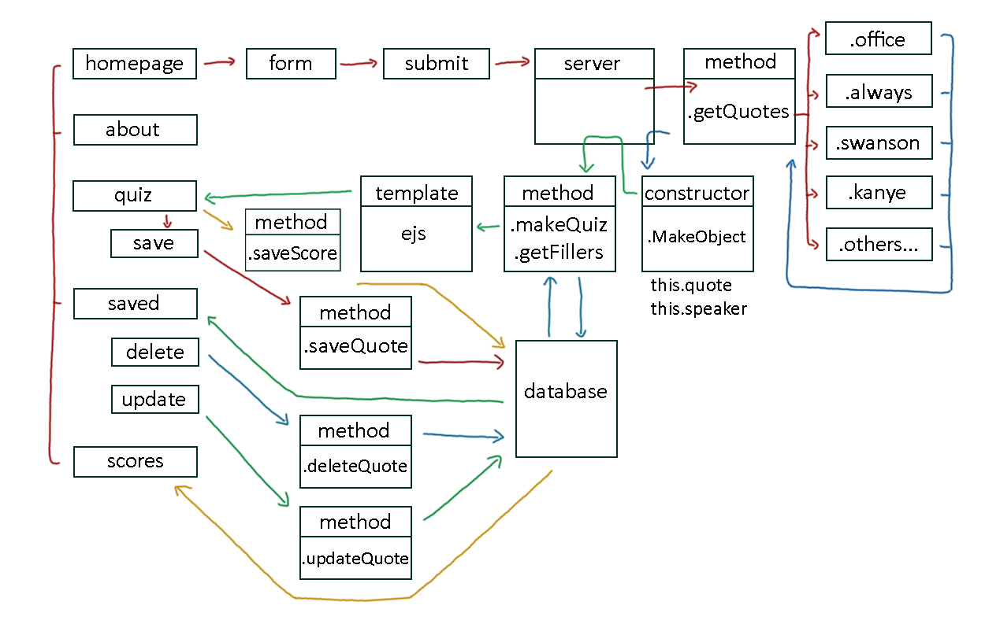
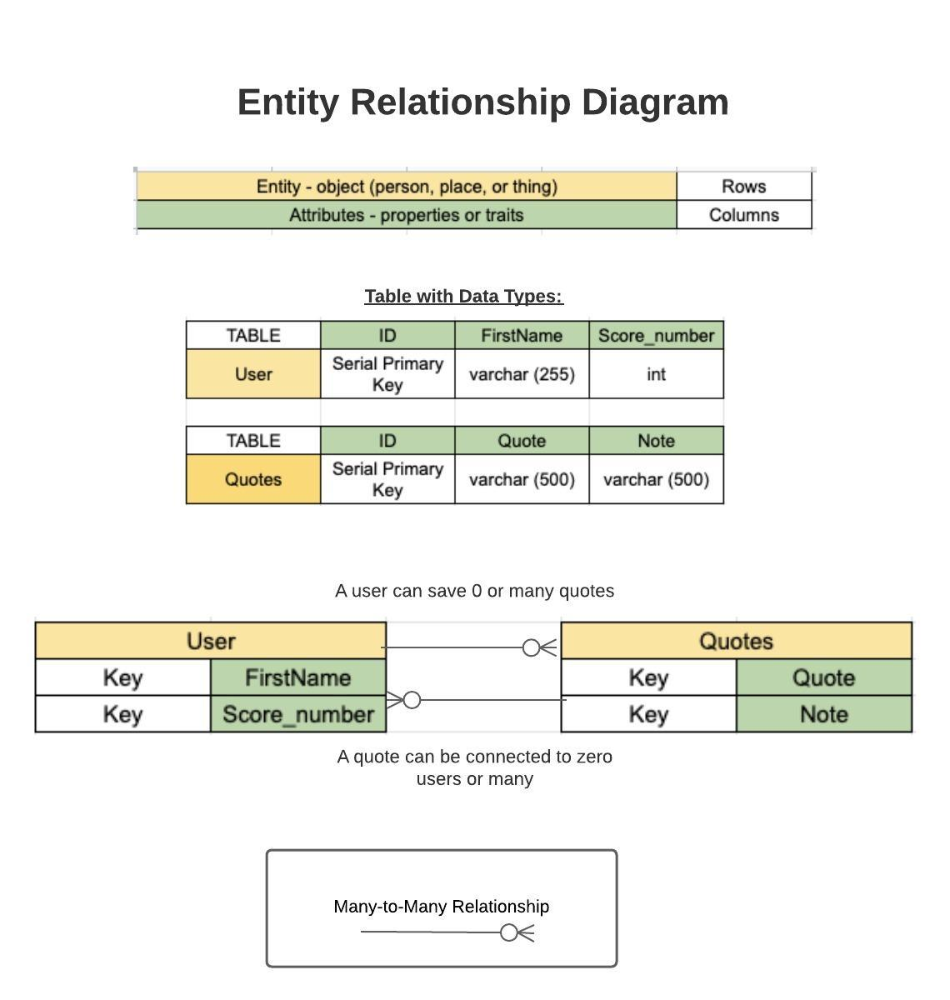
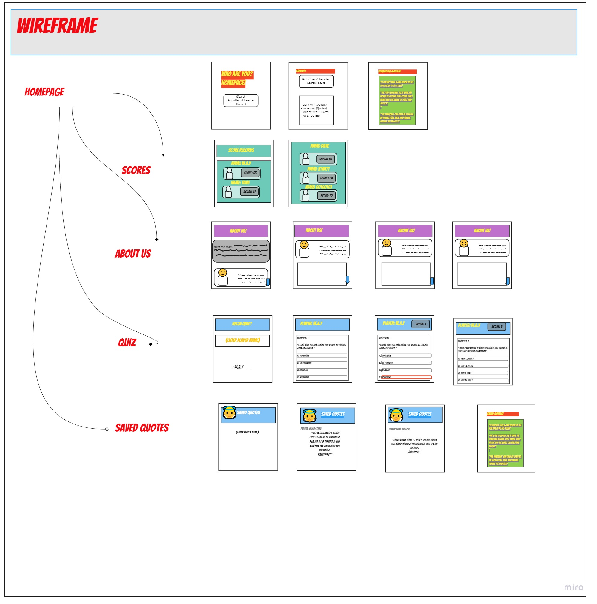

# QuoteFellas
## Version 1.5  
Nov 21, 2020  
## Team QuoteFellas 
+ Grace Choi
+ Klace Koch
+ Dominique Augurson
+ Scott Falbo

## Project Description/Overview
tl;dr - An App that provides users a way to remember moments from their favorite TV show or movie by quizzing their knowledge of memorable quotes. 

This app provides a resource for users to interact with some of the most quotable lines from television and pop-culture. Upon the formation of QuoteFellas, we immediately started to connect over our favorite TV shows, and characters. 

Our app, QuoteFellas brings those quotable and memorable moments to our users. The problem QuoteFellas addresses is getting all of these awesome lines under one roof.

QuoteFellas uses 6 unique APIs that serve some of TV's and pop-culture's best quotes to our users. Upon submitting your name and starting the quiz, QuoteFellas generates a quiz of 5 random quotes. 

## Getting Started
*The way we do it:*
- Create/Navigate to the directory you'd like this to live in.
- Clone our repository to that directory, or just paste this into your terminal;  
 ``git clone https://github.com/gracerosemary/whoareyou``
- ``npm install``
- ``nodemon`` 

## Architecture

QuoteFellas uses javascript, HTML, CSS, and SQL as its base languages. Libraries used include jQuery, nodeJS, postgresql, superagent, cors, and express.

Minimum Viable Product (MVP) definition
- Homepage where user enters name
- Call APIs for quotes
- Return every instance of quote
- Display to front end
- Display multiple choice answers
- Save quote to db 
- Update/Delete feature on saved quote
- Save user's name and score to db
- Style to aesthetically please

### Features: 
- Notes (update feature on saved quote)
- Score keeping
- QuoteFellas

### APIs Used
[The Office Quotes](https://www.officeapi.dev/)  
[Breaking Bad Quotes](https://public-apis.xyz/breaking-bad-quotes-7116)  
[Kanye Quotes](https://kanye.rest/)  
[Always Sunny Quotes](http://www.sunnyquotes.net/api/)  
[Ron Swanson Quotes](https://ron-swanson-quotes.herokuapp.com/v2/quotes)  
[The Simpson Quotes](https://thesimpsonsquoteapi.glitch.me/)  

  

## Change Log
*11/17/2020*
- Created API calls  
- Now capable of returning objects with "quote/quoter".
- Structuring of basic pages.

*11/18/2020*
+ Added a `postgresql` data base
+ Built out the basic structure of the `*.ejs` files
+ Got the APIs and constructors functioning and returning our quote object

*11/19/2020*  
- Basic styling added
- EJS Structures complete
- Saving user input to `postgresql` database
- Seeded dummy data for testing and wildcard names.  

*11/20/2020* 
- Quotes saving to database successfully
- Save quote option is functional.
- Created multiple choice quiz functionality 
- Added button functionality

*11/21/2020*
- Debugged styling issues
- Quiz pages now have uniform 
- Fine touches on CSS
- Save/update/add features added to database (MVP)

*11/23/2020*
- Offically name QuoteFellas
- CSS and styling
- presentation

## Credits  
Thanks to Ray for finding that extra dot for us.
